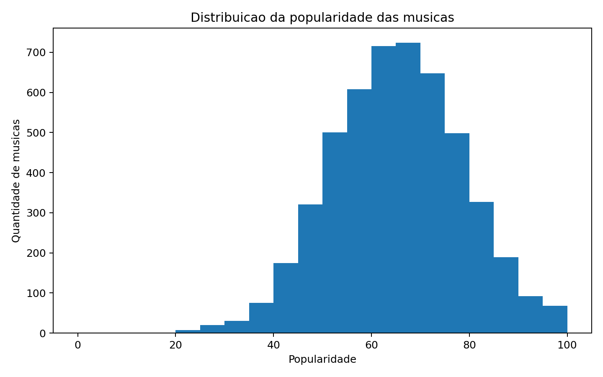
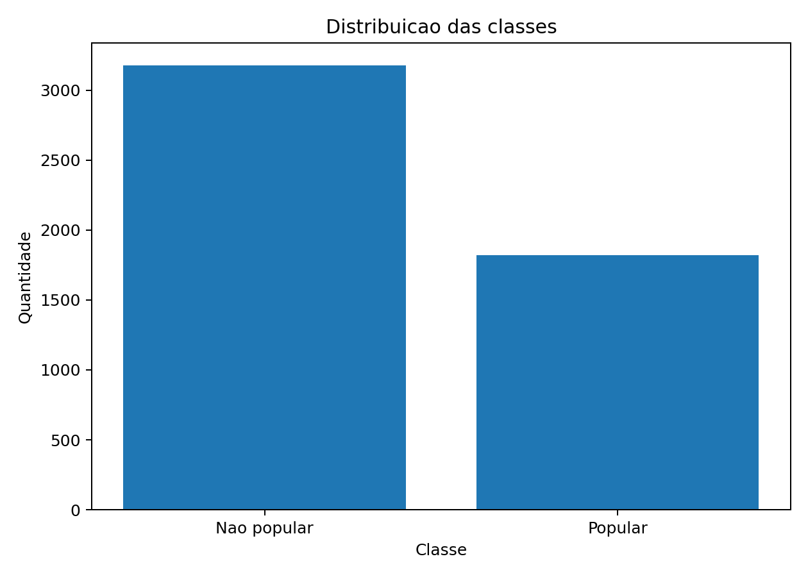
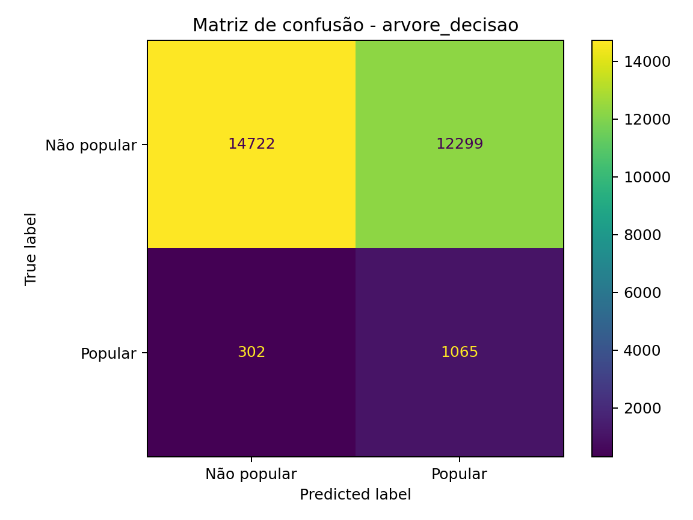
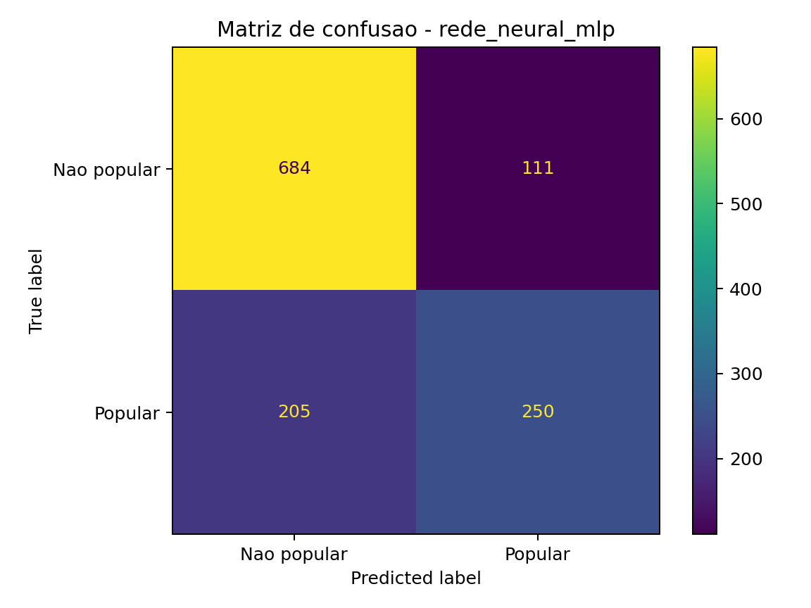
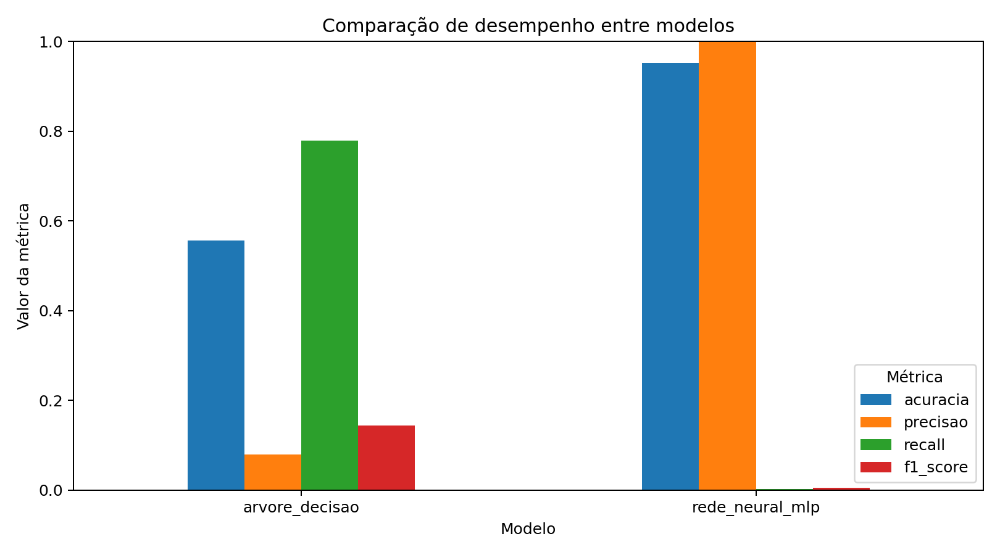
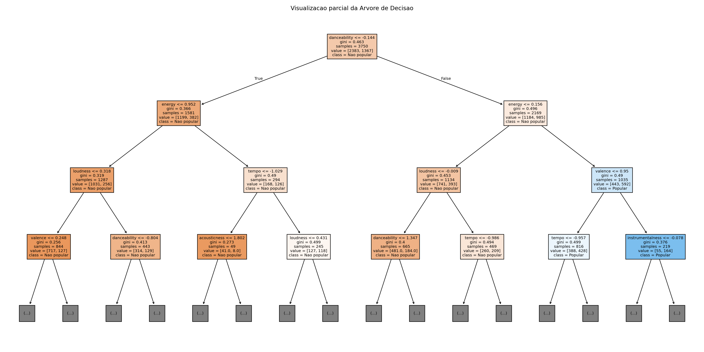
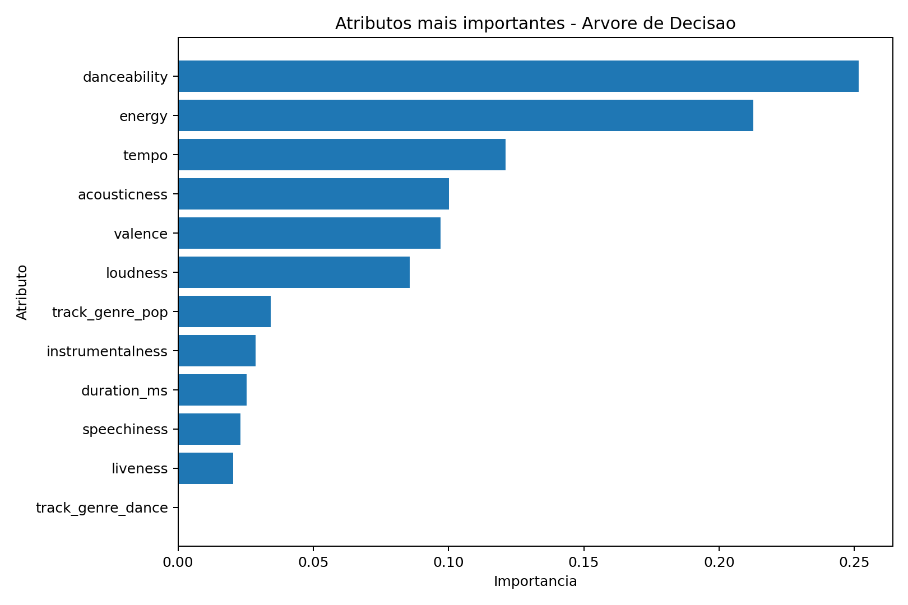
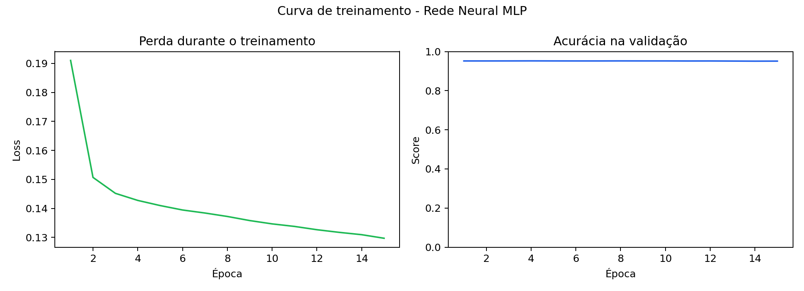

Disciplina de Inteligência Artificial , Professor Munif , Unicesumar 2026

# Trabalho Final - Inteligência Artificial

## Predição de Popularidade de Músicas Estilo Spotify

Este projeto foi desenvolvido para o trabalho final da disciplina de Inteligência Artificial da Unicesumar. O objetivo é aplicar o processo completo de criação de uma solução baseada em IA: definição do problema, preparação dos dados, treinamento de modelos, avaliação, comparação de resultados e conclusão.

---

## Integrantes

- Thiago Poliseli Silva: 25362233-2
- Pedro Toscano: 25362292-2
- Giovanne Leite: 25362248-2

---

## 1. Contextualização

Plataformas de streaming musical, como o Spotify, armazenam diversos atributos sobre as músicas, incluindo características sonoras, gênero, duração e indicadores de popularidade. Esses dados podem ser utilizados para investigar padrões relacionados ao sucesso de uma música.

Neste projeto, foi criada uma base tabular inspirada em datasets de músicas do Spotify, contendo atributos como `danceability`, `energy`, `loudness`, `acousticness`, `valence`, `tempo`, `duration_ms` e `track_genre`.

---

## 2. Problema

O problema investigado é:

> É possível prever se uma música será popular ou não popular com base em suas características musicais?

Para isso, o projeto transforma a coluna `popularity` em uma variável alvo binária chamada `popularidade_alta`.

Critério utilizado:

- `popularidade_alta = 1`: música popular, quando `popularity >= 70`.
- `popularidade_alta = 0`: música não popular, quando `popularity < 70`.

---

## 3. Hipótese

A hipótese da equipe é que músicas com maior energia, dançabilidade, valência e intensidade sonora tendem a apresentar maior popularidade. Assim, espera-se que modelos de Inteligência Artificial consigam identificar padrões nos atributos musicais e classificar músicas como populares ou não populares.

---

## 4. Dataset

### 4.1 Origem dos dados

O dataset utilizado neste projeto foi criado pela equipe por meio do script `src/generate_dataset.py`. A base é sintética, porém inspirada na estrutura de datasets públicos de músicas do Spotify, utilizando faixas realistas para atributos musicais.

O enunciado permite utilizar um dataset existente ou criar um dataset próprio. A escolha por uma base criada pela equipe torna o projeto totalmente reprodutível, sem depender de cadastro em plataformas externas.

### 4.2 Arquivo utilizado

O arquivo principal está em:

```text
data/spotify_tracks_sample.csv
```

### 4.3 Quantidade de registros

- Total de registros: 5.000 músicas.
- Total de colunas: 15.

### 4.4 Principais atributos

| Atributo | Descrição |
|---|---|
| `track_id` | Identificador da música |
| `track_name` | Nome fictício da música |
| `artists` | Nome fictício do artista |
| `track_genre` | Gênero musical |
| `popularity` | Popularidade da música de 0 a 100 |
| `danceability` | Indicador de dançabilidade |
| `energy` | Indicador de energia |
| `loudness` | Intensidade sonora em dB |
| `speechiness` | Presença de fala na música |
| `acousticness` | Grau de características acústicas |
| `instrumentalness` | Grau instrumental |
| `liveness` | Probabilidade de performance ao vivo |
| `valence` | Positividade musical |
| `tempo` | BPM da música |
| `duration_ms` | Duração em milissegundos |

### 4.5 Variável alvo

A variável alvo é `popularidade_alta`, criada a partir de `popularity`.

```python
popularidade_alta = 1 se popularity >= 70
popularidade_alta = 0 se popularity < 70
```

### 4.6 Preparação dos dados

As etapas de preparação realizadas foram:

1. Carregamento do arquivo CSV.
2. Validação das colunas obrigatórias.
3. Remoção de registros com valores ausentes nas colunas utilizadas.
4. Criação da variável alvo `popularidade_alta`.
5. Padronização dos atributos numéricos com `StandardScaler`.
6. Codificação do atributo categórico `track_genre` com `OneHotEncoder`.
7. Divisão da base em treino e teste.

### 4.7 Divisão treino/teste

- Treino: 75% dos dados, totalizando 3.750 amostras.
- Teste: 25% dos dados, totalizando 1.250 amostras.
- Divisão estratificada para manter a proporção entre músicas populares e não populares.

---

## 5. Métodos de Inteligência Artificial Utilizados

O trabalho exige pelo menos um método da Parte 1 da disciplina e pelo menos um método da Parte 2. Neste projeto foram utilizados dois modelos:

### 5.1 Método da Parte 1 - Árvore de Decisão

A Árvore de Decisão é um modelo supervisionado que toma decisões com base em regras geradas a partir dos atributos do dataset. Ela é simples de interpretar e permite visualizar parte da lógica usada para classificar as músicas.

Configuração utilizada:

```python
DecisionTreeClassifier(max_depth=6, random_state=42)
```

### 5.2 Método da Parte 2 - Rede Neural MLP

A Rede Neural MLP, ou Multilayer Perceptron, é um modelo supervisionado baseado em camadas de neurônios artificiais. Ela consegue aprender relações não lineares entre os atributos de entrada e a classe de saída.

Configuração utilizada:

```python
MLPClassifier(
    hidden_layer_sizes=(32, 16),
    activation="relu",
    solver="adam",
    max_iter=400,
    random_state=42,
    early_stopping=True
)
```

---

## 6. Resultados e Avaliação dos Modelos

As métricas utilizadas foram:

- Acurácia
- Precisão
- Recall
- F1-score
- Matriz de confusão

### 6.1 Distribuição da popularidade



### 6.2 Distribuição das classes



### 6.3 Matriz de confusão - Árvore de Decisão



### 6.4 Matriz de confusão - Rede Neural MLP



### 6.5 Comparação gráfica entre modelos



### 6.6 Visualização parcial da Árvore de Decisão



### 6.7 Importância dos atributos - Árvore de Decisão

Este gráfico ajuda a explicar quais variáveis mais influenciaram a Árvore de Decisão.



### 6.8 Curva de treinamento - Rede Neural MLP

Este gráfico mostra a evolução da perda durante o treinamento da rede neural e a acurácia de validação usada pelo `early_stopping`.



---

## 7. Tabela de Métricas

| Modelo | Acurácia | Precisão | Recall | F1-score |
|---|---:|---:|---:|---:|
| Árvore de Decisão | 0.6992 | 0.6010 | 0.5165 | 0.5556 |
| Rede Neural MLP | 0.7472 | 0.6925 | 0.5495 | 0.6127 |

---

## 8. Comparação dos Resultados

A Rede Neural MLP apresentou melhor desempenho geral em comparação com a Árvore de Decisão. O modelo MLP obteve maior acurácia, precisão e F1-score.

A Árvore de Decisão teve desempenho inferior, mas possui a vantagem de ser mais interpretável. Isso facilita a explicação das regras utilizadas pelo modelo. Já a Rede Neural MLP apresentou maior capacidade de identificar padrões mais complexos nos dados, resultando em melhor desempenho preditivo.

Com base no F1-score, que equilibra precisão e recall, o melhor modelo foi a Rede Neural MLP.

---

## 9. Modelo Treinado

Os modelos treinados estão disponíveis na pasta:

```text
models/
```

Arquivos gerados:

```text
models/arvore_decisao.pkl
models/rede_neural_mlp.pkl
```

Esses arquivos podem ser carregados posteriormente com a biblioteca `joblib`.

---

## 10. Como Executar o Projeto

### 10.1 Clonar o repositório

```bash
git clone URL_DO_REPOSITORIO
cd spotify_ia_project
```

### 10.2 Criar ambiente virtual

```bash
python -m venv .venv
```

Ativar no Windows:

```bash
.venv\Scripts\activate
```

Ativar no Linux/Mac:

```bash
source .venv/bin/activate
```

### 10.3 Instalar dependências

```bash
pip install -r requirements.txt
```

### 10.4 Gerar o dataset

```bash
python src/generate_dataset.py
```

### 10.5 Treinar e avaliar os modelos

```bash
python src/main.py
```

### 10.6 Fazer uma predição de exemplo

```bash
python src/predict.py
```

### 10.7 Gerar o PDF do relatório

```bash
python src/generate_pdf.py
```

---

## 11. Conclusão

O projeto demonstrou o processo completo de construção de uma solução baseada em Inteligência Artificial. A equipe definiu um problema de classificação, criou e preparou um dataset, treinou dois modelos supervisionados, avaliou os resultados com métricas e gráficos e comparou o desempenho obtido.

A Rede Neural MLP apresentou melhor desempenho geral, alcançando F1-score de 0.6127 contra 0.5556 da Árvore de Decisão. Portanto, para este dataset e para esta configuração, a Rede Neural MLP foi o modelo mais adequado para prever a popularidade das músicas.

Apesar disso, a Árvore de Decisão continua sendo útil por sua maior interpretabilidade, principalmente em apresentações acadêmicas, pois permite visualizar parte das regras de decisão usadas pelo modelo.
